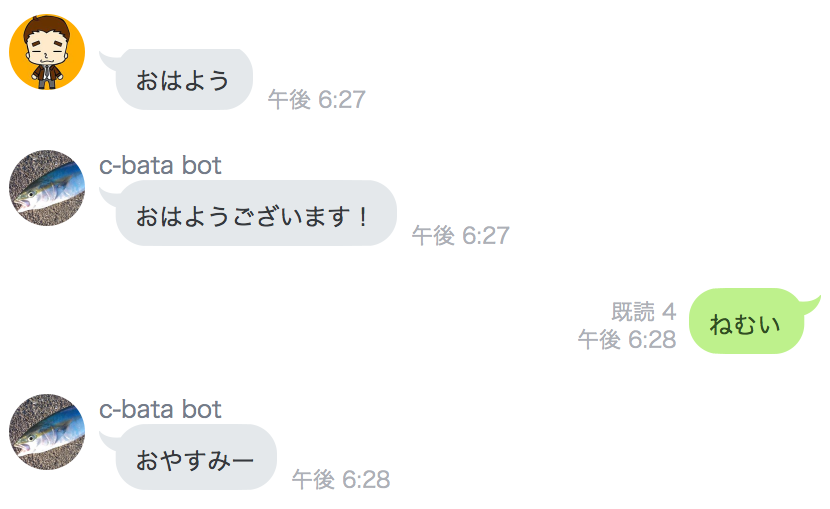
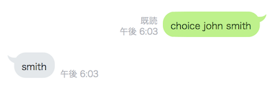
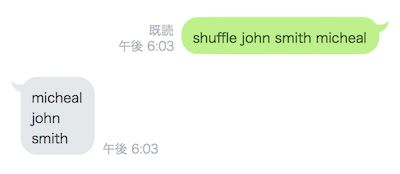
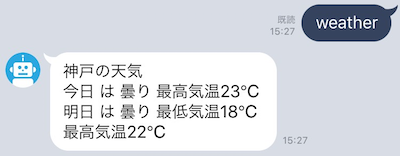
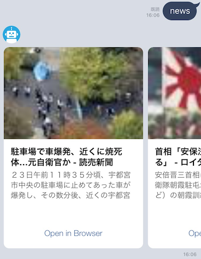
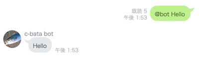

LINE BOT on AWS Lambda + API Gateway using Chalice.

## Functions

| Command   | Image                                 |
|-----------|---------------------------------------|
| Greeting  |  |
| Choice    |      |
| Shuffle   |    |
| Weather   |    |
| News      |          |
| Echo      |          |

## How to run

#### Setup

Create `.chalice/config.json` :

```console
$ cat .chalice/config.json
{
  "app_name": "linebot", 
  "stage": "dev"
}
```

#### Environment Variables

Set environment variables on your AWS console.

```bash
export LINE_BOT_CHANNEL_ACCESS_TOKEN=xxxxxxxxxxxxxxxxxxxxxxxxxxxxxxxxxxxxxxxxxxxxxxxxxxxxxxxxxx
export LINE_BOT_CHANNEL_ACCESS_SECRET=xxxxxxxxxxxxxxxxxxxxxxxxxxxxxxx
```

#### Deploy to AWS Lambda and API Gateway

Deploying by chalice cli:

```console
$ chalice deploy
```

#### Configuration on LINE DEVELOPERS

Open your line bot setting's page and Set WebHook url.

`https://hoge.execute-api.ap-northeast-1.amazonaws.com/dev/callback`

Success! :tada:

## Development

Chalice-Bot depends a Pillow.
So If you want to create deploy package, you must it in Amazon Linux.
However, it is very inconvenient to create an instance of EC2 for that.
So please use `Dockerfile.deploy`.

```console
$ make help
Commands:
    build                Build docker container
    deploy               Deploy to AWS Lambda and API Gateway
    lint                 Check coding styles
    test                 Run tests
    functions            Show the list of AWS Lambda functions
    help                 Show help text
```

#### How to deploy

Set environment variables:

```sh
export AWS_ACCESS_KEY_ID=xxxxxxxxxxxxxxxxxxxx
export AWS_SECRET_ACCESS_KEY=xxxxxxxxxxxxxxxxxxxxxxxxxxxxxxxxxxxxxxxx
export AWS_DEFAULT_REGION=ap-northeast-1
export S3_BUCKET_NAME=xxxxxxxxxxx

export LINE_BOT_CHANNEL_ACCESS_TOKEN=xxxxxxxxxxxxxxxxxxxxxxxxxxxxxxxxxxxxxxxxxxxxxxxxxxxxxxxxxx
export LINE_BOT_CHANNEL_ACCESS_SECRET=xxxxxxxxxxxxxxxxxxxxxxxxxxxxxxxx
```

After that:

```console
$ make deploy
```

## LICENSE

MIT. See [LICENSE](./LICENSE)
