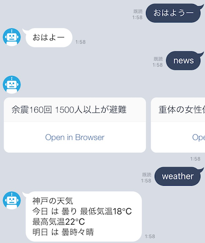

# chalice-linebot

LINE bot with AWS Lambda + API Gateway.

## Functions

| Command   | Image                                 |
|-----------|---------------------------------------|
| Weather   |    |
| Greeting  |  |
| Shuffle   |    |
| Choice    |      |
| Echo      |          |

## Requirements

- Python2.7
- chalice
- line-bot-sdk

## How to run

### Setup

Create `.chalice/config.json` :

```console
$ cat .chalice/config.json
{
  "app_name": "linebot", 
  "stage": "dev"
}
```

Set `CHANNEL_ACCESS_SECRET` and `CHANNEL_ACCESS_TOKEN` :

```console
$ vim app.py  # and setting your channel secret and channel access token.
```

### Deploy to AWS Lambda and API Gateway

Deploying by chalice cli:

```console
$ chalice deploy
```

### Configuration on LINE DEVELOPERS

Open your line bot setting's page and Set WebHook url.

```
https://hoge.execute-api.ap-northeast-1.amazonaws.com/dev/callback
```

Success! :tada:



## Development

### Setup environment

```
$ virtualenv -p python2.7 venv
$ source venv/bin/activate
$ pip install -r requirements.txt -r requirements-dev.txt
```

### Running tests

```
$ python -m unittest tests
```

### LICENSE

MIT. See [LICENSE](./LICENSE)
